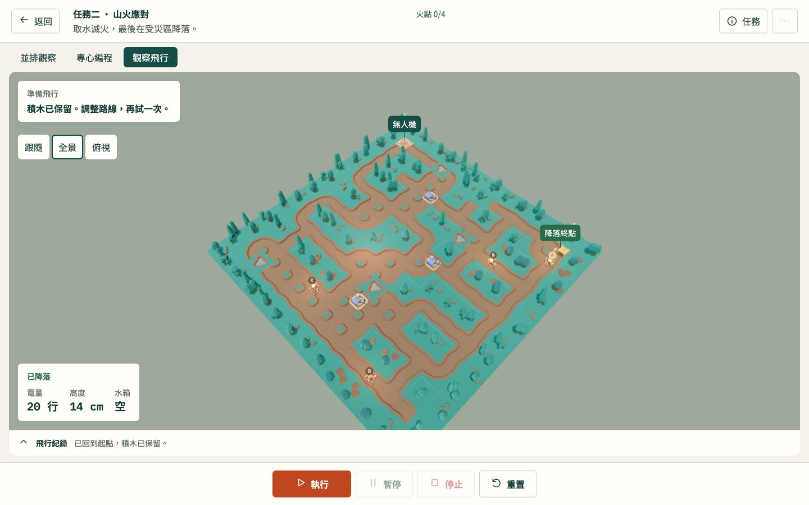
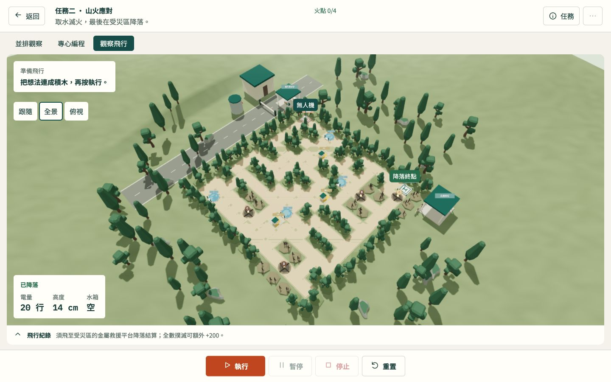

# Mission 2 v2 — comparison and QA

Verified 2026-09-24 on `codex/mission2-v2-scene`, against Legacy baseline `e3f656d`. No push or deployment. Legacy remains the default; original scene builders, mission rules, scoring, physics, coordinates and asset bytes are preserved.

## Run and rollback

Use the existing local server, open `http://localhost:8080/?scene=mission2-v2`, then select Mission 2. Remove the query or use `?scene=mission2-legacy` for Legacy. The query only affects Mission 2; there is no student-facing variant control. Returning to Legacy requires no data migration or file replacement.

Local reproduction harness: `http://localhost:8080/audit/mission-2-v2/harness.html?scene=mission2-v2`. Its buttons run actual Blockly fixtures, compare contracts, and collect measurements. F8 hides/shows its panel. The audit folder is excluded from the existing Pages package.

## Before and after

| | Legacy | Mission 2 v2 |
|---|---|---|
| Strengths | Existing readable grid and functioning mission markers | Continuous landscape, coherent woodland silhouettes, contrasting access paths, rescue staging and visible H landing pads |
| Weaknesses / tradeoffs | Isolated repeated tiles and props; limited surrounding context | Grid layout remains intentionally recognizable to preserve route rules; more triangles and runtime labels |
| Story | Generic forest exercise | Closed service access, ranger hut, water tank, rescue shelters, scorched fire areas and recovery landing point |
| Assets | Existing mixed forest/factory props | Four existing Kenney Nature Kit models instanced with a shared palette, plus authored primitives; original sensor geometry retained privately |

Full asset provenance, CC0 evidence, file formats, modifications and scale: [asset register](../../docs/assets/mission-2-v2-assets.md). No third-party files were downloaded or modified. New model/texture network payload: 0 bytes. Four visible existing model files total 54,524 bytes. New JavaScript and runtime geometry/Canvas textures are additional costs.

## Gameplay evidence

- `npm test`: **21/21 passed**, including immutable baseline declaration hashes, exact grid/spawn parity, opt-in selection, actual Blockly generation and route validation.
- `node scripts/verify-static-site.cjs`: **164 offline entries verified**, no deployment. `git diff --check` passed.
- `contract-parity.json`: **19 checks**, including 6,360 sensor geometry readings, 841 collision probes, charge once/reset, fire visibility/reset, partial mission completion, scoring deduplication and exact light restoration.
- `v2-four-fires.json`: actual **42-command** Blockly execution, all four fires, three charging stations, successful landing, **1,225 points**, battery 36, no collision. Completion screenshot records 79 seconds.
- `legacy-reference.json` and `v2-reference.json`: the same existing **68-command** reference XML finishes both scenes with **3/4 fires, 925 points, battery 36**. Its missed fourth water pickup is an existing limitation, deliberately unchanged.
- Reset/retry, takeoff, mid-flight, follow/overview/top cameras, result screen and briefing legend were inspected. Scene switching through tunnel/free/city restores global atmosphere (`scene-switches.json`). No browser errors were captured during the successful flight runs (`browser-errors.json`).

Sensor parity is a geometry comparison, not a claim that every Legacy sensor program works: Legacy's raycaster visits non-wall Sprite labels without a camera and can throw. The harness temporarily excludes Sprite raycasts while sampling both versions and restores the prototype in `finally`. V2 decoration opts out of raycasting. No original sensor function was changed. The original briefing also lists the last water cell as (12,3), while the actual grid is (12,2); its pre-existing coordinate prose remains unchanged.

## Rendering measurements

Desktop in-app browser, 1440×900 viewport, 1408×638 canvas, idle full overview; each sample covers 120 display frames. Use the `*-performance-final.json` files for these measurements. Earlier files capture a different, spawn-centered camera and are retained as intermediate evidence.

| Metric | Legacy | V2 |
|---|---:|---:|
| Draw calls | 1,223 | 160 |
| Rendered triangles | 67,157 | 111,639 |
| Display interval median | 16.7 ms | 16.7 ms |
| Display interval p95 | 17.6 ms | 17.7 ms |

The two intentional overview radii differ (Legacy 3200, v2 3800) to frame their complete environments. Counts include the renderer's shadow/drone work; they are not normalized asset-only benchmarks. Display intervals are RAF cadence, not GPU timings. Renderer memory counters include resources accumulated during switches, so they are not presented as isolated per-scene memory budgets. These desktop results do not establish physical iPad GPU performance.

## Visual evidence and limits

- `legacy-overview.png`, `v2-overview.png`, `v2-top.png`: 1440×900 comparison and aerial readability.
- `v2-takeoff.png`, `v2-flight.png`, `v2-follow.png`: actual execution, including close follow camera.
- `v2-objective.png`: camera inspection of the landing objective; drone state was not moved.
- `v2-completion.png`: actual four-fire result.
- `v2-laptop.png`, `v2-laptop-split.png`: 1280×800 scene and Blockly split layout.
- `v2-ipad.png`, `v2-ipad-result.png`: 1180×820 landscape viewport and result layout.

Responsive evidence is desktop browser viewport emulation; physical iPad/Safari and touch-only usability are not verified. Flight and responsive screenshots preceded the final minor alignment of charging equipment to its preserved sensor envelope; final overview/top/objective captures include that alignment. No gameplay code changed between these captures.

Review was performed by the main agent, with no subagents. The optional design detector returned an empty issue list in **degraded mode** because parser dependencies were unavailable; this is not a clean automated design certification. Visual acceptance is based on rendered screenshots and the recorded checks above.
